# Release Lifecycle

A Release will go through a lifecycle of **stages** and **phases**.

Stages include **Build**, **Candidate**, **Current**, and **Revoked**.
The ATR does not manage build stage releases. It takes over on the transition from the build to the cnadidate stage.
Stages control where on the **ATR** Website a release can be found.

Phases are states or activities during a Release's life cycle.

```mermaid
flowchart TD
    subgraph Apache Trusted Release
    A[GHA Secure Release Process]
    B[Current SVN Build Process]
    C@{ shape: docs, label: "Release Candidate" }
    A -->|automatically triggered| C
    B -->|manually triggered| C
    subgraph Release Candidate Stage
    D@{ shape: processes, label: "Evaluate Candidate" }
    C --> D
    DD@{ shape: process, label: "Sign Candidate" }
    D -->|pass| DD
    GG@{ shape: processes, label: "Distribute Test" }
    E@{ shape: sl-rect, label: "Release Vote" }
    JJJ@{ shape: dbl-circ, label: "Passes" }
    F@{ shape: dbl-circ, label: "Failed" }
    E -->|pass| JJJ
    E -->|fail| F
    D -->|fail| F
    F -->|new candidate| C
    DD --> GG
    GG --> E
    end
    subgraph Current Release Stage
    JJ@{ shape: docs, label: "Release" }
    JJJ --> JJ
    G@{ shape: processes, label: "Distribute" }
    H@{ shape: trap-t, label: "Manual Distribution" }
    G -->|optional| H
    G --> I
    FF@{ shape: dbl-circ, label: "Distribution\nFailed" }
    G -->|failure| FF
    I[Announce Release]
    FF -->|retry| G
    FF -->|abandon| K
    H -->|manually triggered| I
    J@{ shape: dbl-circ, label: "Released" }
    JJ --> G
    I --> J
    K@{ shape: dbl-circ, label: "Revoked" }
    L@{ shape: trap-t, label: "Announce CVEs" }
    J -->|revoke| K
    J -->|cves| L
    L -->|record cves| J
    end
    end
```

## Phases

**Announce CVEs**
: At some moment as or after a release happens a project may announce CVEs that either impact or are solved by a release. The security team and PMC manage CVEs including announcements and publishing via cveprocess.apache.org The ATR will update SBOMs with new CVEs.

> Note where this is an explicit phase or not depends on integration discussions with the security team.

**Announce Release**
: Send a compliant announcement of the release. This template will include release metadata.

**ATR Platform**
: Apache Trusted Release is a service with a web UI and restful API for managing the lifecycle of project releases.

**Current SVN Build Process**
: This is our current SVN repository process for setting up a release candidate. Trigger the ATR automation by including release metadata.

**[Distribute](./distributions.md)**
: Release distribution will be automated for many channels.

**[Distribute Test](./test-distributions.md)**
: Release Candidates may be distributed to Test repositories.

**Distribution Failed**
: A Release may fail one or more of its Distribution Steps. This may be due to a problem with the destination. The project will need to manually retry. The distributions steps should include reasonable retry logic.

**Evaluate Candidate**
: Report on the Candidate by performing numerous checks for policy compliance. Fails if compliance minimums are unmet.

**Failed**
: A Release Candidate may end in this state. The project can either abandon it or update and resubmit it.

**GHA Secure Release Process**
: In a GitHub workflow the release candidate is built and validated following the Security Release Policy.

**Manual Distribution**
: Some channels either require manual steps, or they are yet to be automated.

**Passes**
: The Release Candidate has been accepted. Convert the candidate into a Release and proceed to Distribute and Announce the Release.

**Release**
: The release is a folder of files including metadata, SBOMs, public keys, signatures, and checksums.

**Release Candidate**
: A release candidate consists of a folder of release files including metadata, SBOMs, public keys, signatures, and checksums.

**Release Vote**
: Release policy requires a Vote on the project's dev list. The ATR records votes in the platform and also on the mailing list. The Vote will be summarized and the PMC Vote recorded in the releases metadata.

**Released**
: Once the Release is distributed and announced, this Release should remain in this state as long as it is available.

**Revoked**
: A Release in this state has been revoked or abandoned.

**Sign Candidate**
: Optionally sign packages using digital certificates through a service.
