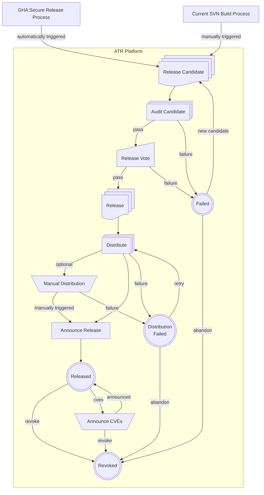

# Release Lifecycle

```mermaid
flowchart TD
    A[GHA Secure Release Process]
    B[Current SVN Build Process]
    C@{ shape: docs, label: "Release Candidate" }
    A -->|automatically triggered| C
    B -->|manually triggered| C
    subgraph ATR Platform
    D@{ shape: processes, label: "Audit Candidate" }
    C --> D
    E@{ shape: sl-rect, label: "Release Vote" }
    F@{ shape: dbl-circ, label: "Failed" }
    FF@{ shape: dbl-circ, label: "Distribution\nFailed" }
    D -->|pass| E
    D -->|failure| F
    F -->|new candidate| C
    F -->|abandon| K
    FF -->|retry| G
    FF -->|abandon| K
    G@{ shape: processes, label: "Distribute" }
    E -->|pass| JJ
    E -->|failure| F
    H@{ shape: trap-t, label: "Manual Distribution" }
    G -->|optional| H
    I[Announce Release]
    G --> I
    G -->|failure| FF
    H -->|manually triggered| I
    H -->|failure| FF
    J@{ shape: dbl-circ, label: "Released" }
    JJ@{ shape: docs, label: "Release" }
    JJ --> G
    I --> J
    K@{ shape: dbl-circ, label: "Revoked" }
    L@{ shape: trap-t, label: "Announce CVEs" }
    J -->|revoke| K
    J -->|cves| L
    L -->|announced| J
    L -->|revoke| K
    end
```
