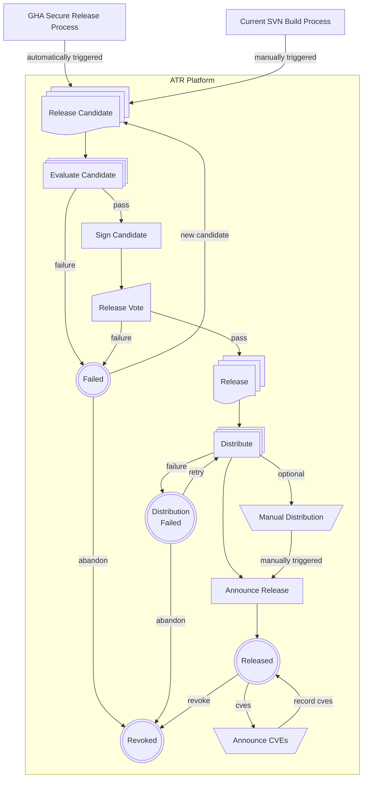

# Release Lifecycle

## Definitions

**GHA Secure Release Process**
: In a github workflow the release candidate is built and validated following the Security Release Policy.

**Current SVN Build Process**
: This is our current svn repository process for setting up a release candidate. Trigger the ATR automation by incuding release metadata.

**Release Candidate**
: A release candidate consists of a folder of release files including metadata, SBOMs, public keys, signatures, and checksums.

**ATR Platform**
: Apache Trusted Release is a service with a web ui and restful api for managing the lifecycle of project releases.

**Evaluate Candidate**
: Report on the Candidate by performing numerous checks for policy compliance. Fails if compliance minimums are unmet.

**Sign Candidate**
: Optionally sign packages using digital certificates through a service.

**Release Vote**
: Release policy requires a Vote on the project's dev list. The ATR will record votes in the platform and also on the mailing list. The Vote will be summarized and the PMC Vote recorded in the releases metadata.

**Failed**
: A Release Candidate may end in this state. The project can either abandon it or resubmit a new candidate.

**Release**
: The release is a folder of files including metadata, SBOMs, public keys, signatures, and checksums.

**Distribution Failed**
: A Release may fail one or more of its Distribution Steps. This may be due to a problem with the destination. The project will need to manually retry. The distributions steps should include reasonable retry logic.

**Distribute**
: Release distribution will be automated for many channels.

**Manual Distribution**
: Some channels either require manual steps, or they are yet to be automated.

**Announce Release**
: Send a compliant announcement of the release. This template will include release metadata.

**Released**
: Once the Release is distributed and announced this Release should remain in this state as long as it is available.

**Revoked**
: A Release in this state has been revoked or abandoned.

**Announce CVEs**
: At some moment after a release happens a project may announce CVEs that either impact a release or are solved by a release. The security team and PMC manage CVEs including announcements and publishing via cveprocess.apache.org The ATR will update SBOMs with new CVEs.
