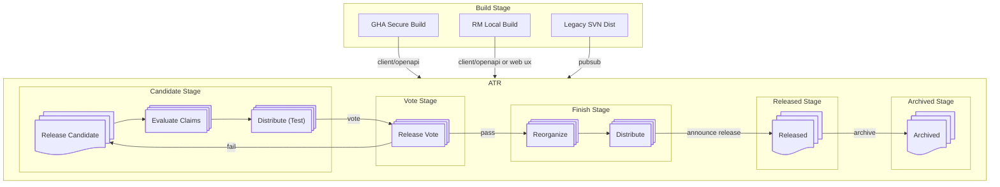

# Release Lifecycle

A Release goes through a lifecycle of **stages**.

Stages include **Build**, **Candidate**, **Vote**, **Finish**, **Released**, and **Archived**.
The ATR does not manage build stage and legacy releases. It takes over the release process on the transition to the candidate stage.
Stages are the states of a release in the **ATR**.

## Phases

**[Announce Release](https://www.apache.org/legal/release-policy.html#release-announcements)**
: Send a compliant announcement of the release. This template will include release metadata and should point to our static release download page. That page should refer back to the project's website.

**Archived Stage**
: A Release in this stage/phase has been archived, revoked, or abandoned.

**[ATR Platform](./platform.md)**
: Apache Trusted Releases is a service with a web UI and REST API for managing the lifecycle of project releases.

**[Distribute](./distributions.md)**
: _in progress_ Release and Test distributions will be automated for many channels. An email will be sent about package managers which need manual distribution.
Once that is complete the Release Manager will need to move to the next Phase. If all distributions automatically complete then moving to the next phase is automatic.

**[Evaluate Claims](./evaluate.md)**
: Evaluate claims on the Candidate by performing numerous checks for policy compliance. Fails if compliance minimums are unmet.

**[GHA Secure Build](./github-build.md)**
: In a GitHub workflow the release candidate is built and validated following the Security Release Policy.

**[Legacy SVN Dist](./svn-dist.md)**
: This is our current SVN repository process for setting up a release candidate. Trigger the ATR automation by including release metadata.

**[Migration](./svn-dist.md)**
: We need a phase for migration of existing current and archived releases from the legacy platform into the ATR data store.

**Passes**
: The Release Candidate has been accepted. Convert the candidate into a Release and proceed to Distribute and Announce the Release.

**[Release](./data-model.md)**
: The release is a folder of files including metadata, SBOMs, public keys, signatures, and checksums.

**[Release Candidate](./data-model.md)**
: A release candidate consists of a folder of release files including metadata, SBOMs, public keys, signatures, and checksums.

**[Release Vote](./vote.md)**
: Release policy requires a Vote on the project's dev list. The ATR records votes in the platform and also on the mailing list. The Vote will be summarized and the PMC Vote recorded in the releases metadata.

**Released**
: Once the Release is distributed and announced, this Release should remain in this phase as long as it is available.

**[RM Local Build](./platform.md)**
: Release Managers upload or push a release candidate into the ATR using either an API or a web page.
