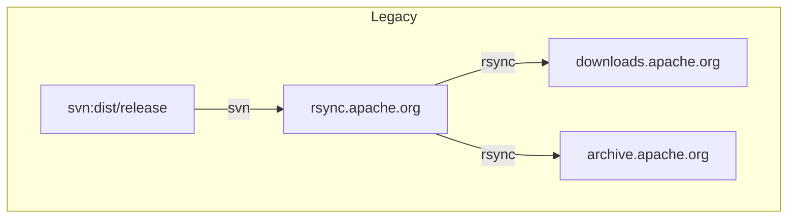
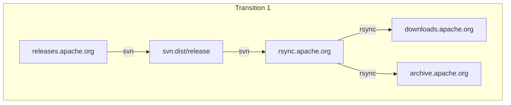
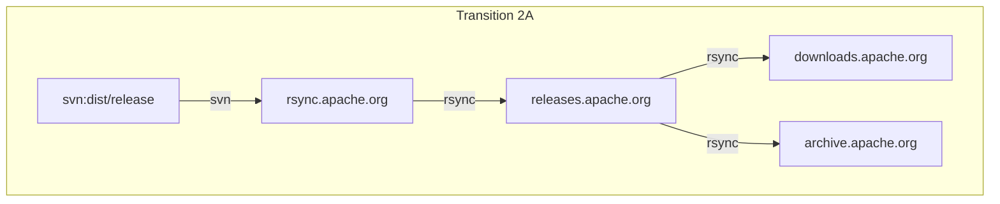
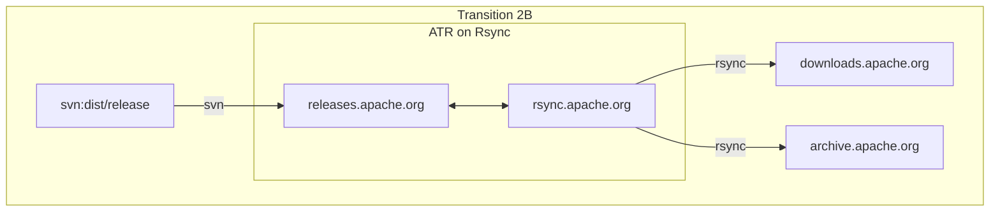
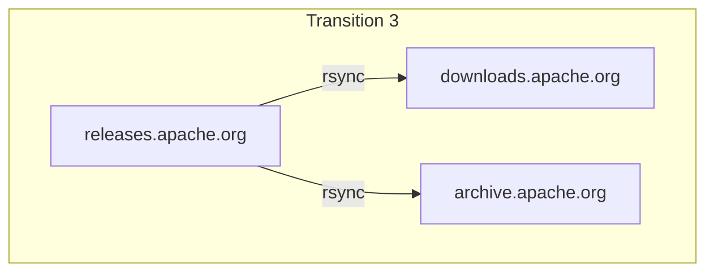
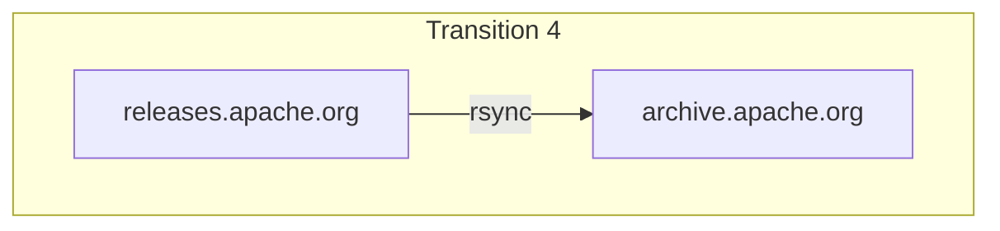

Title: Legacy Releases from SVN Dist
license: https://www.apache.org/licenses/LICENSE-2.0

We have three types of Releases to create using a "Pull from 'Dist'" process.

1. Release Candidates from `dist/dev` as the Release Manager requests from within the ATR Web UI.

2. Current Releases from `dist/release` this will be used for the initial migration and may be used from time to time as PMCs use the old methods.

3. Archived Releases which are migrated from the archive if not present in the Current Releases.

## ATR Web UX

We will need pages to perform tasks related to the use of our legacy setup.

### PMC Management Page

1. **Create Release Candidate** - upload the packages for a release candidate from `svn:dist/dev`. This page can also handle direct uploads.

3. **Legacy Release** - upload an approved release from `svn:dist/release`.

### System Admin Page

1. **Synchronise Current Releases** - scan `svn:dist/release` and migrate any not in the ATR.

2. **Synchronize Release Archive** - scan `archive` repository and migrate any archived not in the ATR as a Current or Archived Release.

## Backends Hosting Release Artifacts

The legacy domains are currently connected to `svn:dist/release` as follows:

1. rsync.apache.org has a directory that updates a checkout of `svn:dist/release`
2. downloads.apache.org periodically rsyncs with rsync.apache.org
3. archive.apache.org periodically rsyncs with rsync.apache.org without removing artifacts from the destination.

### Transitional Steps

1. **ATR writes to SVN** - ATR Releases write to `svn:dist/release` as an interim step.

2. **ATR and Legacy are Integrated** - Insert ATR into the rsync chain.
   - ATR has a directory with the same organization as `svn:dist/release` using symbolic links to the Releases in the ATR Datastore.

   - (a) ATR's rsync from rsync.apache.org should detect legacy release addition and deletion.

   Or

   - (b) ATR coexists on rsync.apache.org and detects legacy release addition and deletion.

3. **Legacy is Retired** - `svn:dist/release` is retired.

4. **Further Integration** - downloads.apache.org is hosted on ATR. Downloads.apache.org is multiple servers. ATR would need to work on multiple servers

